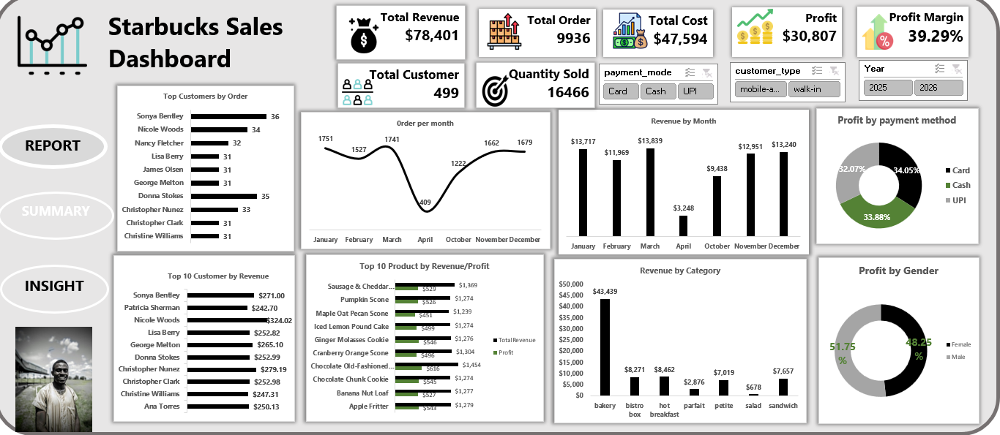

# SQL-Excel--Sales-dashboard-capstone
Sales Performance Dashboard built with Microsoft Excel and MySQL, featuring interactive visualizations and business insights.
# Sales Performance Dashboard

## Dashboard Preview

## Project Overview
This project analyzes retail sales data using MySQL and Microsoft Excel to provide business insights into sales performance, customer behavior, and product performance. The analysis answers key business questions and presents the findings in an interactive Excel dashboard.

## Objectives
- Analyze overall sales performance.
- Identify top-performing products.
- Identify high-value customers.
- Track monthly sales trends.
- Calculate revenue, cost, profit, and profit margin.
- Provide actionable business recommendations.

## Tools Used
- Microsoft Excel
- MySQL

## Dataset
The dataset contains information on:
- Customers
- Products
- Sales Transactions
- Quantity Sold
- Revenue
- Cost

## Business Questions Answered
1. How many unique customers made purchases?
2. Which products generated the highest revenue?
3. Which products sold the highest quantity?
4. What is the monthly sales trend?
5. Who are the top customers by revenue?
6. What are the total revenue, total cost, total profit, and profit margin?

## Dashboard KPIs
- Total Revenue
- Total Orders
- Total Customers
- Quantity Sold
- Total Cost
- Total Profit
- Profit Margin

## Key Insights
- Revenue reached **$78,401**.
- Profit totaled **$30,807**.
- Profit margin was **39.29%**.
- 499 customers made purchases.
- A total of 936 orders were processed.
- 16,466 units were sold.

## Recommendations
- Increase inventory for top-selling products.
- Focus marketing efforts on high-value customers.
- Monitor monthly sales trends to improve forecasting.
- Improve profit by promoting high-margin products.

## Files Included
- Dashboard.xlsx
- Dashboard.pdf
- SQL_Queries.sql
- Dashboard_Screenshot.png

## Author
**Emediong Sunday**

Aspiring Data Analyst passionate about transforming data into actionable business insights using Excel, SQL, and Power BI.
